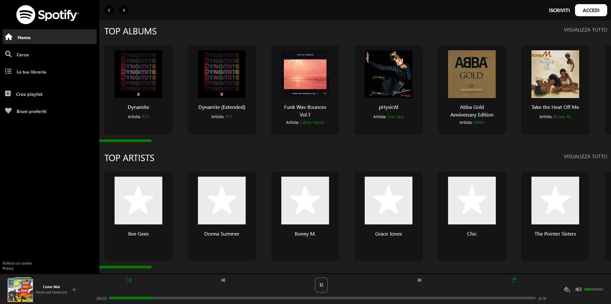

<h1>Progetto SpotifyWeb</h1>
<h3>Riproduzione di una delle più famose Web App</h3>

<em>Menu ed elementi reattivi all'hover e responsivo</em>

Linguaggi utilizzati:

<ul>
<li>HTML</li>
<li>SCSS</li>
<li>JAVASCRIPT</li>
</ul>

Librerie utilizzate:

<ul>
<li>REACT</li>
<li>AXIOS</li>

</ul>

Anteprima

